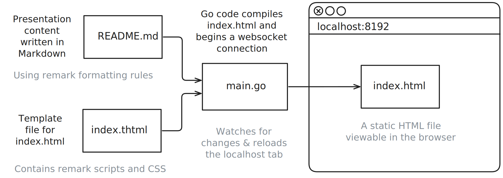

class: center, middle

# Workshop Title

**Subtitle: A slide deck template powered by Remark.js and Go**

Author: Your Name

*CSWG Workshop June 10 2025*

[http://ciwg.github.io/workshop-YYYY-MM-DD-template/](http://ciwg.github.io/workshop-YYYY-MM-DD-template/)

For additional materials visit the repo on [Github](https://github.com/ciwg/workshop-YYYY-MM-DD-template/)

---

## Agenda

1. Introduction
2. How it works
3. Quick Start
4. Setting up Github Pages
5. Code Example
6. Table Example

---

## Introduction

This template uses [remark](https://remarkjs.com/#1) and Go to build and serve slide presentation. Slides are written in Markdown using a couple 'formatting rules' and compiled with Go into a static HTML file.

--

### Remark.js:
- Use `---` to separate slides, `--` to increment a slide
- Highly customizable with CSS and JavaScript
- Supports speaker notes (press "P" to toggle in/out)
- Configurations (e.g. scroll navigation) can be enabled or disabled

Visit the [wiki](https://github.com/gnab/remark/wiki/Markdown) to understand more built-in formating options.
--

### Go code:
The Go code in this repo extends the basic functionality of Remark.js by automating the slide building process, incorporating a template file, and enabling live-reloading during presentating & development.

???
This is a speaker note. View speaker mode using "P" hotkey or insert #p to the url, for example: http://localhost:8192/#p5

---

## How it works

.center[]

**NOTE:** Sometimes the browser caches too aggressively & recent changes won't displayed. Use **`Ctrl+Shift+R`** (or `Cmd+Shift+R` on Mac) to complete a 'hard refresh' of your browser tab.  

---
## Prerequisites
1. A modern web browser
2. A Text editor
3. Go 1.8 or newer (Install instructions: https://go.dev/doc/install)
4. Internet connection to load RemarkJS script

---

## Quick Start

**Copy this template**
1. Visit the [workshop template](https://github.com/ciwg/workshop-YYYY-MM-DD-template/), and click "Use this template".  


- Make sure **Owner** is set to "ciwg" (Community Systems Working Group). 
    - This creates the repo under our organization and you retain access to 'Github Pages' Settings later.
        - Alternatively, you can create repo under your account, then create a fork under the ciwg organization.
        - *Avoid transfering ownership to CSWG, as this will require admin rights to activate Pages.*
- Name your repository following **'workshop-YYYY-MM-DD-workshop-name'** format.

**Modify the content**
1. Clone the repo to your local machine.
3. Edit `README.md` to create the content of your workshop.
4. In your terminal, `go run main.go` (or just `make`) to generate and host `index.html`
5. Open your browser and navigate to http://localhost:8192 to view your slides.

---

## Github Pages

1. Push to GitHub
2. Go to Settings > Pages
3. Select source: main branch, / (root)
4. Your slides will be live at:
'https://ciwg.github.io/your-workshop-name/'
5. Update the URL on the cover page as needed.

Optional: Click the Settings ⚙️ in the About section of the repo. Check ✅ 'Use your GitHub Pages website'

---

## Code Example

```go
package main

import "fmt"

// a long function that causes the code block to need a scrollbar
// to demonstrate that code blocks can be scrolled
func longFunction() {
    // do nothing for several lines
    fmt.Println("Hello, World!")
    fmt.Println("Hello, World!")
    fmt.Println("Hello, World!")
    fmt.Println("Hello, World!")
    fmt.Println("Hello, World!")
    fmt.Println("Hello, World!")
    fmt.Println("Hello, World!")
    fmt.Println("Hello, World!")
    fmt.Println("Hello, World!")
    fmt.Println("Hello, World!")
    fmt.Println("Hello, World!")
    fmt.Println("Hello, World!")
}

func main() {
    fmt.Println("Hello, World!")
}
```

---

## Table Example

Insert a table to display data:

| Feature       | Description                          |
|---------------|--------------------------------------|
| Markdown      | Simple syntax for writing slides     |
| LaTeX         | Support for mathematical expressions |
| Customization | CSS and JavaScript for styling      |

You can modify table formatting by editing the CSS in the template file.

---

class: center, middle

# Thank You!

